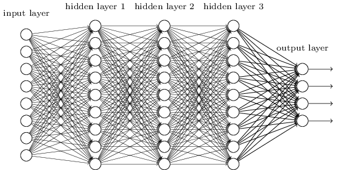
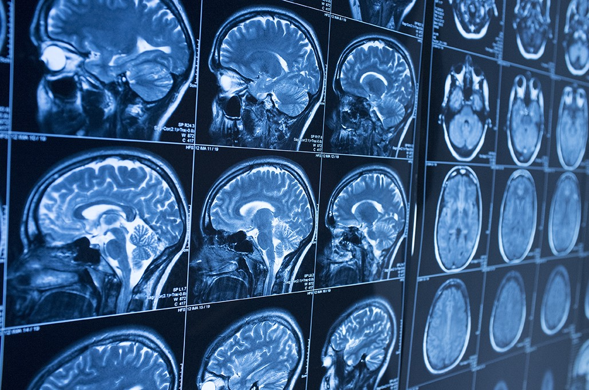
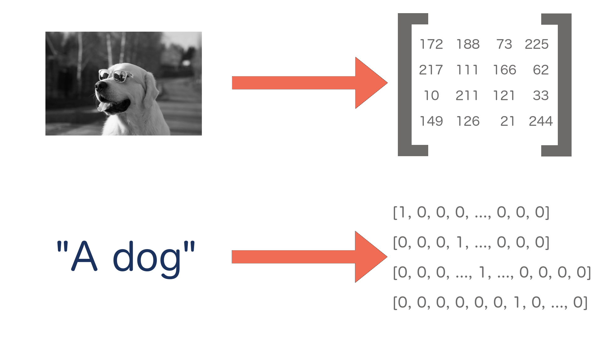
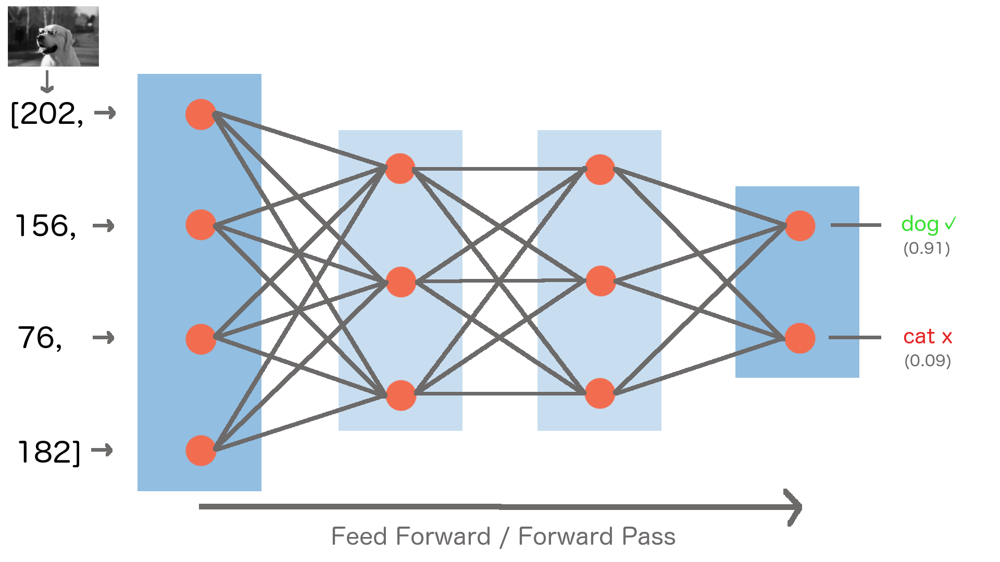

title: Taking the Plunge: Deep Learning in Libraries
url:
class: animation-fade
layout: true

<!-- This slide will serve as the base layout for all your slides -->
.bottom-bar[
  {{title}}&nbsp;&nbsp;&nbsp;&nbsp;&nbsp;&nbsp;{{url}}
]

---
# Taking the Plunge: Deep Learning in Libraries

## Kevin Beswick (@kbeswick)
## Bret Davidson

### NC State University Libraries

To see the speaker notes press "p"

???

Great you're seeing the speaker notes!

Here are some notes for the speakers to control the slide deck:

- c: Create a clone presentation on a new window
- p: Toggle PresenterMode
- f: Toggle Fullscreen
- t: Reset presentation timer

---

</img>

???

You've probably heard a lot about machine learning in the news, and have
undoubtedly interacted with things that use it. I'm going to talk
about what it is, what it can be used for, how it works and its
application in libraries.

---
# Computers are good at:

- Calculations
- Data storage and retrieval
- Displaying data
- Automation of routine tasks

# Computers are bad at:

- Pattern recognition
- Perception
- Generalization
- Inference

???

Let's set the stage a little bit. Computers have traditionally been good at calculations, data storage, retrieval and display, automating things that used to take a while to do manually, and following well defined rules and structures.

Computers have traditionally been worse at pattern recognition, perception (knowing what something is), generalization, and inference (making predictions).

These are some of the areas where deep learning is helping to improve the performance of computers.

---
class:impact
# SumaVision Demo

???
We'll start off with a demo that maybe 5-7 years ago would have been very hard to accomplish using traditional computing tools.

To give some context, Suma is an application we developed at NC State for doing space analytics. Generally the way this is done is that someone walks through the library with an IPad and observes with their own eyes what people are doing in our spaces. They manually capture the number of people by navigating the space and pressing a button for each person they see.

---
# SumaVision Demo

<video controls src="videos/sumav_1.mov" type="video/mp4" class="img-squash img-center"/>

???

We'll look at ethical considerations later in the talk, but what if we could capture images of a space and use that to count the number of people?

We built this demo to show that we can do something like this pretty easily. You can see that this was captured in Suma.

---
# Machine Learning

- “A field of computer science that gives computers the ability to learn without being explicitly programmed”
  - https://en.wikipedia.org/wiki/Machine_learning

## Supervised Learning

- Making a prediction based on labeled training data

## Unsupervised Learning

- Describing hidden structure from "unlabeled" data

???
Machine learning can be broadly defined as "A field of computer science that gives computers
the ability to learn without being explicitly programmed"

There are two main categories of machine learning. Supervised learning is when we have an algorithm that learns how to make predictions based on labeled data it has access to in advance. Examples of supervised approaches are things like linear regression, logistic regression, and random forests. An example problem for supervised learning is given a dataset of historical real estate listings and prices that the homes sold for, predict the price a home will sell for that's being put on the market today.

The other broad category is unsupervised learning, which is concerned with trying to find patterns in unlabeled datasets. An example of this might be classifying unlabeled textual data, like topic modeling or document clustering.

The majority of research so far has been in the area of supervised learning because
unsupervised learning is a much harder problem.

---
# Deep Learning
</img>

???
Deep learning is a subfield of machine learning that involves the use of deep artificial neural networks.

These neural networks loosely mimic how the human brain works with layers of neurons with connections between them.

Concretely, deep learning algorithms are neural networks, and they are generally a type of supervised learning. We train them with labeled data and then we make predictions on new, unseen data.

---
# Deep Learning vs. Traditional Machine Learning

* Generalizable
* More Powerful
* Domain Neutral
* Task Agnostic

???

Deep learning is generalizable and more powerful than traditional machine learning.

In traditional machine learning we have to manually define features, which is time intensive and requires domain expertise. For example, if we were looking for dogs in an image, I would have to tell the computer that one feature of a dog is that they have ears, some of which are droopy, some of which stand up, can be these colors, etc. Dogs also have tails, sometimes they are long, sometimes they are short. You can see where I'm going with this. We have to manually engineer features that tell the computer what to look for with our best approximation of all possible scenarios. Deep learning algorithms can learn the features of a dog automatically by being shown a sufficiently sized, representative dataset of images of dogs.

Neural networks don't need to know anything about the problem domain they are working in. In fact, they don't even know that they are operating on images. All they see are numbers.

The same deep learning algorithms can be used for different tasks. If I wanted to have an algorithm to tell me if an image is a cat or a dog, it could also tell me if something was a hot dog or a pizza.

The code doesn't need to change, only the data being used to train the network.

---
class:impact
# What is deep learning good for anyway?

???
Let's talk about what problems deep learning is good at solving and specific examples of its applications.

---

# Computer Vision
- Image classification
- Object detection/localization
- Image captioning

</img>
</img>

???

One area is computer vision, which is concerned with recognizing what is in an image and where objects are within an image.

Some example applications are self-driving cars, or analyzing medical imagery to help with early disease detection.

---
# Natural Language Processing
  - Machine translation
  - Language modeling
  - Word embedding

 </img>

???
Deep learning is also used for Natural Language Processing problems like translation and identifying concept similarity within text.

---
# Audio processing
  - Speech-to-text
  - Text-to-speech

</img>

???
Audio processing - digital assistant examples fall here. For example, take audio of a human voice and convert it into text so a machine can act on it. Or synthesize some text into human-like speech.

---
class: impact
# How do neural networks work?

???
Let's build some intuition around how deep neural networks work.

---

# High Level Process

- Define a prediction problem: given some data X, can I predict Y?
  - Example: given an image, can I predict whether it is of a cat or a dog?

- Gather training data
  - Images of cats and dogs that are already labeled "cat" or "dog"

- Train the neural network (the model) to make correct predictions on these pre-labeled images

- Ask the neural network to make predictions on new, unseen images
  (inference)

???

The general process we'll have to go through to train a neural network
is as follows:

read slide

---

# Everything is Numbers

</img>

???

The first point I want to make is that everything is numbers to a neural
network, and all the network is really doing is performing calculations on those numbers.

So we're making predictions on things like images and text, but
first we need to represent these numerically. Computers already do this
behind the scenes in a lot of cases.

For black and white images, we can represent them as a matrix of numbers, where each
number represents the intensity of a particular pixel (or how light/dark
it is).

There are similar approaches for text and other data.

---

# Neural Network Model

</img>

???

Here's what a standard neural network looks like. They are organized as
stacked layers of neurons, with connections between them. Each
connection has a numerical weight that represents how strong the
connection is, and these weight values are what we need to learn as part of the
training process. The connection weights are initialized completely randomly before training
the neural network.

An important thing to note about this diagram is that while
I'm showing only a small number of weights, neurons and layers, a real
model could have millions of neurons, hundreds of layers, and many thousands of weights -
an extremely large structure to reason about. This is why neural
networks are sometimes described as black boxes - we know how they work,
but they are so big that it's sometimes difficult to interrogate specific
decisions they make.

Our input image is fed into the network through the input layer on the left. The data flows
through the neurons and connections in the hidden layers in the middle, until a prediction is made at the output layer at the
end of the network.

Each neuron does a similar mathematical operation - apply the weights to the incoming signals, combine them,
run through an activation function, and repeat. The activation function
represents whether the neuron fires or not. Over time, each neuron
learns to detect a specific feature in the image. Earlier neurons (to
the left side of the network) learn to detect simpler features like edges, and later neurons detect higher level
features like ears, noses, tails. The final layer looks at the highest
level features that were detected to determine the probability that
our image was of a cat or a dog.

---

# Training a Neural Network

</img>

???

To train the network, we show it an image in the training set, and we get a score at the end of how likely the network
thinks the image is of a cat or of a dog. The network's predictions will be completely random at first since the weights
were initialized randomly. Since the training images are labeled and we have the right answer, that this is
a dog, we can say we'd like the probability for dog to go up, and for
all other classes to go down. We can achieve this using a mathematical process called back
propagation and stochastic gradient descent, which goes through the network backwords calculating which
direction each weight needs to be adjusted in order to achieve our desired result.

---

# Training a Neural Network

</img>

???

We then update the weights just a little bit so that next time
the network sees our image, it will be closer to the correct answer. We repeat this
over the entire training set of images many times until the network
makes good predictions across the entire training set.

---

# Trained Model

- Weights are set to values such that model makes good predictions on
  training set
  - Training set should be a representative view of reality in order to
    generate a good model
- Inference
  - Can now run unseen examples through model to get predictions
- Single purpose
  - Can recognize cats and dogs, but not horses
  - But can just add images of horses to training set, add third output
    class, and retrain model

???
- When the model has been trained on a large representative dataset,
  it should be very good at distinguishing between cats and dogs.
- Our model is now ready to be put into production within an application that will feed it new data.
- But if you showed it a picture of a horse, it would be very confused, since it
  has never seen a horse before. It would likely report low confidence
  scores for both cat and dog
- If you needed the ability to recognize horses, you would add a third
  node to the output layer, expand your training dataset to include
  labeled pictures of horses, and retrain the model.
- There is no need to write a manual horse recognition algorithm and
  integrate it to your application, you can just retrain the
  network.

---
class:impact
# How do neural networks learn?

???
Now that we have some intuition about how neural networks work, we've prepared a demo that will help us understand how neural networks learn and how a model performs at different stages of development.

---
background-image: url(images/mariokart.jpg)

???
Self-driving Mario Kart! Why did we think this would be a good example?

- needed a way to create a large amount of labeled input data quickly
- visualize the performance of the model using different sizes of data sets
- and really, we just wanted an excuse to play mario kart at work

---
# How do we do this?

- Model is trained using inputs:
  - Screenshots of the game taken at prescribed intervals (.2 seconds)
  - Controller input (joystick angle and which buttons are pressed)

- Predictions are made:
  - Given NEW, untrained screenshot, generate NEW joystick inputs

???
We wrote a program that took a screenshot of the game every 0.2 seconds, while at the same time recording the controller input.

The model then makes predictions given NEW, untrained screenshots, and generates NEW joystick inputs, which we feed back into the game automatically

---
<video controls src="videos/1.mov" type="video/mp4" class="img-squash img-center"/>

???
This is an early stage demo trained on a single lap around the track. It hasn't learned much yet, it's not turning.

A few notes on how this is working. You are seeing the prediction part of deep learning. We are taking rapid screenshots of the game, passing the image (as a multi-dimensional array of numbers) to our model, getting a prediction (controller input), and then sending that input into MarioKart.

---
<video controls src="videos/2.mov" type="video/mp4" class="img-squash img-center"/>

???
This example is a model that has been trained on 3 laps around the track. You can see it can now do basic turns.

The window on the right is showing the input that is being sent. Notice how quickly the predictions are being made, every line in the terminal output is a prediction.

---
<video controls src="videos/3.mov" type="video/mp4" class="img-squash img-center"/>

???
~15 mins of play

This example performs much better, and can do things like error recovery. This one can actually finish a race.

---
class: impact
# Opportunities in Libraries

???

A major part of our initial exploration in this area was to identify some of the opportunities in libraries.

We've found three major categories.

---
class:impact
# New functionality

???

First is integrating deep learning into our own applications to get some new functionality we couldn't get before.

---

# WolfTales

<video controls src="http://siskel.lib.ncsu.edu/SCRC/mc00581-wt-peele-20151030/mc00581-wt-peele-20151030.mp4" type="video/mp4" class="img-sqash img-center" />

???

Let's look at a few seconds of this Wolf Tales video. I want you
to pay attention to some of the key things he mentions.

---

# Audio/Video Processing

<video controls src="videos/deep_catalog_1_720.mov" type="video/mp4" class="img-squash img-center"/>

???
Here's a demo catalog application we've developed to show how we could leverage
deep learning to get a head start in metadata generation for newly
digitized or created materials, and how we could improve discovery
without any human generated metadata.

I'm going to ingest this video and only give it a title and author.

So what is happening here? When I uploaded the video, in the background, the audio was extracted automatically and it was run through a speech to text model. The full text is being indexed into Solr and now I can search for things that we heard in the video.

Now that we have a textual transcription, imagine what else we can do.
We can definitely provide it directly to users and automatically enable
captioning on the video. We can do further analysis on that text, and
generate recommendations for appropriate subject headings, or at least
get the key terms or create a summary in an automated way.

---
# Newspapers

<video controls src="videos/deep_catalog_3_720.mov" type="video/mp4" class="img-squash img-center"/>

???

Here's another.
This one uses the same model architecture as
SumaVision, but we took off the later layers and retrained on new data
we collected.

This one finds the location of headlines and images in
newspapers. We can then run further processing to find out what is in
the image, and to OCR the headlines. We can then offer more fine grained
search results based on the articles in a newspaper, and the ability to
jump to that specific article automatically since we know what page its
on in the newspaper and where on the page it is.

---

class:impact
# Supporting Researchers

???
The second opportunity for libraries is supporting researchers through deep learning consultations and research sprints.

---
# Snowflake Classification

    </img>
    </img>
    </img>

???

A faculty member at NCSU from the dept of marine, earth, and atmospheric sciences, contacted the libraries looking for machine learning support. They have an extremely large dataset of over 1 million snowflake images.

They have used a number of "traditional" machine learning techniques to attempt to classify degrees of "riming" on snowflakes, that is, how large or small the clusters of ice are. We worked with them to develop a proof of concept deep learning model to further improve on their results.

This has also been an opportunity to begin to explore the viability of providing this kind of service to researchers. Is it useful for them? Can we scale this kind of support?

---
class:impact
# Cultural Heritage Ecosystem

???
A third opportunity area is developing the ecosystem around deep learning use in cultural heritage institutions

---
# Data Annotation and Sharing
- opportunities for defining best practices for sharing models and approaches
- using standards like IIIF and WebAnnotation/OpenAnnotation

???

To encourage sharing of models and data, we can develop best practices that include standards that are already being used in libraries, such as IIIF. We've been developing approaches that use collections of IIIF image URLs as training datasets rather than static copies of images. This allows for a distributed training data set potentially spanning over many institutions, and simplifies the data sharing process by reducing its size.

We are also having our deep learning services output annotations in standardized formats like WebAnnotation or OpenAnnotation so that they can be viewed in existing image viewers and be provided in a consistent format.

---
# Current Work

- We're really interested in study spaces and furniture
- How do people use our furniture? Can it be better configured? Are new
  spaces being effectively used?

???

I want to talk about something we're currently exploring. I want to
emphasize that this is not a production application, and there are a lot
of internal conversations that would need to happen before we even consider
productionizing something like this.

If you've been to our libraries, you know we're very into study spaces
and furniture. In order to be responsible stewards of state and private
funds, we'd like to maximize the use of our study spaces and furniture.
To help with this, we conduct periodic assessements of how people use our
spaces

Currently we use a tool I mentioned at the beginning of this talk, Suma
to do this. The use of Suma is very expensive though, because it relies
on manual data collection by humans. What if we could use deep learning
to learn more about the use of our furniture and spaces?

---
# Approach

- YOLOv3 - an object detection network
- Transfer learning
- Manual annotation of data
  - Drawing boxes around chairs
- Develop the surrounding infrastructure to collect data, process it,
  store results

???

We built a prototype that can identify the number of people in a space,
the number of each type of chair, and the number of chairs that are
occupied. It does this by using a neural network called YOLOv3, which is
a generic object detection network that was trained to find 80 different
objects in images, such as people, chairs, dogs, cats, etc. However, we
want it to be able to differentiate between the different chairs in our spaces.

We used a technique called transfer learning to achieve this. Remember
when I mentioned how the later layers of a neural network look for
higher level features in an image? We remove a few of those layers, and
the output layers, and replace them with newly initialized layers and a
new output layer to correspond to all the different chair types we want
to predict.

We then retrain these new layers with data we've manually labeled with
different chairs. We can use much less data than training the entire
network because it already knows how to detect lower-level features,
which means it also trains faster. We annotated about 100 images of
chairs and we saw fairly good results in our tests - this would likely be more if
we expand to other spaces and chair types.

We developed infrastructure to go from a capturing an image,
transforming it into a format that the neural network expects, to
assembling the data output including the type and location of each
chair, the number of chairs that are occupied and the number of people
in the space. This is done on a regular interval. We also developed a
pipeline to produce visualizations of the observations.

---
# Total people in space over time
</img>

???

We can do basic plots like total number of people observed in the space
over a period of time.

---
# Chair usage by type
</img>

???

We can see the usage of particular types of chairs over time.

---
# Brown Eames chair movement over a day
</img>

???

Where it gets interesting though, is that since we know the location of
each chair and person observed, we can plot things in space as well as
time.

Here's a heatmap showing how Brown Eames chairs move around the
space. The more intense the color, the more often the chair was seen in
that area. You can see the chairs along the walkway tend to move around
more while the inner ones tend to move less.

---
# Which chairs get used most often?
</img>

???

Here's another heatmap showing which chairs tend to get the most use.

You can see that people tend to use the chairs closer to the bookcase on the right, as well as the rainbow marshmallow couches.

Information like this would be useful when testing reconfigurations
of an existing space, or launching a new space.

---
# Lessons Learned

- Annotating data is expensive
- There are existing models out there that will likely perform well on
  your task
- Most of the work comes with setting up the data pipeline and getting
  the data into the right state for input to the network
- Ethics/Data privacy

???

We learned some lessons about tacking machine learning projects along
the way. First, deep learning requires a lot of labeled data to work
effectively, and annotating data is expensive. Rather than collecting
your own data and annotating it, see if there are existing machine
learning services that could meet your needs, use an existing dataset, or an approach like
transfer learning for more custom applications. Chances are there is a
model or data out there you can use, saving time and effort.

We also realized that most of the work we had to do was setting up
infrastructure around capturing data, transferring/manipulating/cleaning
data, and working on output format, rather than playing with deep
learning models themselves. Data people are probably saying told you so
right now.

Finally, deep learning and related technologies bring a whole slew of
privacy and ethical issues that we haven't really had to consider as
much when designing software systems in the past. Because of their heavy
reliance on data, more often than not user data, there are
considerations that we have to work through.

---
# Questions to ask when taking on a machine learning project

- Does the data that I have accurately predict what I am trying to
  predict?
- What is the worst case scenario in the case of erroneous predictions?
- How am I handling the data that is used to train the model? What am I
  doing with the data used to make predictions after it is processed?
- How/what do I communicate to users about how it is working, or how
  their data is being used?

???

Here are a few questions to consider when thinking about applying
machine learning to project. First, how correlated is the data I'm
feeding into the network to the prediction it is making? How much
potential does this have to expose bias in the data?

What is the worst case scenario in the case where the model makes a bad
prediction? In the case of the last example, we might end up with bad
statistics. Maybe in a more forward facing application, the user might
have a negative experience. In extreme cases, like with self driving
cars, it could result in injury or death.

How am I handling the data that is needed to train the model, and data
that is captured as part of making predictions? Am I storing data that
should not be stored? Is it secure? How long do we retain it? Should I
even be capturing it or using it at all?

How do we communicate to users about what we're doing, or how their data
is being used?

---

# Ethics

- data is often the source of bias in this technology
- identify ways to create more representative data sets
- expose to the user that we are using this technology
- give them the option to provide feedback
- give them the option to turn it off

???
We hope we've convinced you through this presentation that the data used to train models is where bias is often introduced.

What are some concrete steps we can take to reduce the potential bias of these systems and their impact on users?

We can create more representative data sets.

We can make it clear to the user when we are using deep learning in our services.

We can give users the option to provide feedback, which could influence how the model is trained in the future.

We can give users the option to turn off deep learning enhancements.

---

class:impact

# Thanks!

## Kevin Beswick (kdbeswic@ncsu.edu)
## Bret Davidson (bddavids@ncsu.edu)
